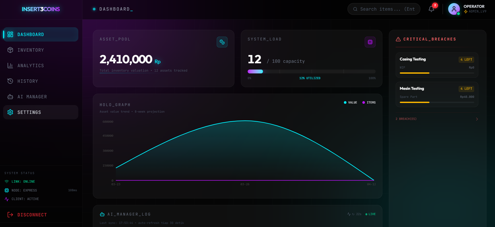
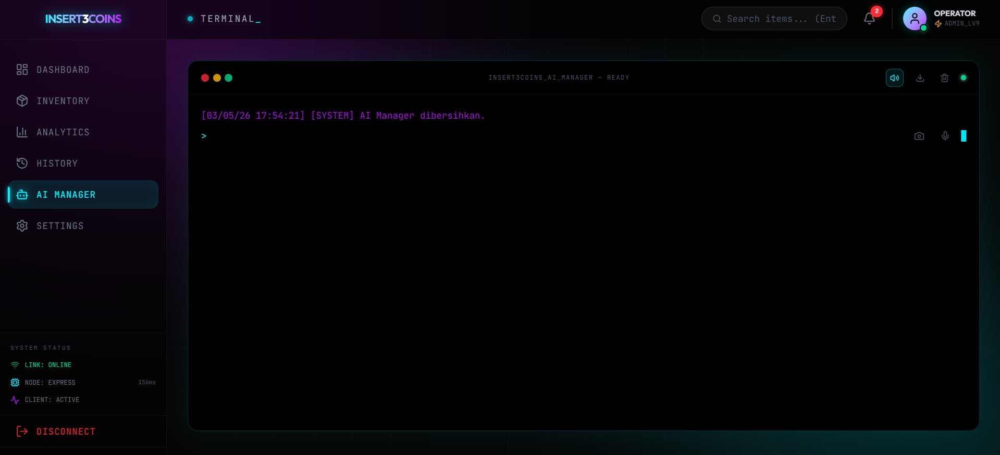

<div align="center">
  
  
  # 🤖 INSERT3COINS AI Manager
  
  **Sistem Manajemen Inventori Cerdas Berbasis AI dengan Arsitektur Skala Enterprise**

  [](https://reactjs.org/)
  [](https://nodejs.org/)
  [](https://www.docker.com/)
  [](#)
</div>

---

## 🌟 Fitur Unggulan (Key Features)

Aplikasi **INSERT3COINS** bukan sekadar sistem kasir atau inventori biasa. Sistem ini dirancang untuk bekerja bagaikan memiliki asisten dan manajer gudang sungguhan melalui integrasi *Artificial Intelligence* tingkat lanjut.

### 🧠 1. Asisten Suara AI (Cortex)
*   **Perintah Bebas:** Cukup bicara atau ketik dalam Bahasa Indonesia (*"Cortex, tolong rakit 5 Remote Daikin pakai bahan baku Kotak A"*).
*   **Cortex Vision:** Pindai foto barang dengan kamera, dan AI akan otomatis mengenali, mengklasifikasi, atau menjual barang tersebut.
*   **Multi-Model Failover:** Terintegrasi dengan cloud AI (Groq/Cerebras/OpenRouter) dan memiliki pengaman lokal (*local fallback*).

### 🏭 2. Sistem Perakitan Cerdas (BOM Assembly)
*   **Multi-Assembly Sinkron:** Sinkronisasi otomatis antara jumlah target rakitan dan kebutuhan bahan baku gudang.
*   **Validasi Real-time:** Mencegah perakitan jika stok komponen tidak mencukupi (Terkunci Otomatis).
*   **Pemisahan Kas Kasir:** Proses *Assembly* (pengurangan bahan baku & penambahan barang jadi) diisolasi agar tidak mengacaukan perhitungan omzet penjualan harian.

### 📊 3. Analis Bisnis Otomatis (Hermes Llama 3.2)
*   **Laporan Telegram Harian:** Setiap jam 00:00 tengah malam, Hermes AI akan membaca *database* dan mengirimkan laporan ringkas nan profesional ke Telegram.
*   **Deteksi Anomali:** AI secara aktif menganalisis jika ada barang yang penjualannya merosot tajam atau jika prediksi stok akan segera habis (*Runway Analysis*).
*   **Peringatan Stok Cerdas:** Hanya melaporkan stok kritis (`< 2 unit`) agar Anda tidak "disepam" oleh notifikasi yang tidak perlu.

### 🎨 4. Antarmuka Cyberpunk yang Memukau
*   **Desain Premium:** Menggunakan estetika *Neon Dark Mode*, efek kaca (*Glassmorphism*), dan animasi halus (*Framer Motion*).
*   **Terminal Log Live:** Menampilkan riwayat transaksi secara *real-time* seperti layar *hacker* profesional.

---

## 🏗️ Arsitektur Teknologi

Proyek ini dipisah menjadi dua modul utama (Client-Server) yang disatukan menggunakan **Docker Compose**.

*   **Frontend (`/client`):** React.js + Vite, TailwindCSS (Styling), Framer Motion (Animasi).
*   **Backend (`/server`):** Node.js, Express.js, Better-SQLite3 (Transaksi Atomik anti-gagal).
*   **AI Local Engine:** Ollama (Llama 3.2 3B).
*   **Infrastruktur:** CI/CD via GitHub Actions untuk *deploy* otomatis ke VPS (Ubuntu).

---

## 📸 Tampilan Antarmuka (Screenshots)

<div align="center">
  
  
  <p><b>Dashboard Inventori Utama dengan Tema Neon Cyberpunk</b></p>

  

  <p><b>Antarmuka Terminal Cortex AI (Suara & Visual)</b></p>
</div>

---

## 🚀 Cara Menjalankan Secara Lokal (Development)

Pastikan Anda telah menginstal **Node.js** dan **Docker** di komputer Anda.

### 1. Jalankan Backend (API)
```bash
cd backend
npm install
npm run dev
```

### 2. Jalankan Frontend (UI)
Buka terminal baru:
```bash
cd frontend
npm install
npm run dev
```

---

## 🐳 Deployment (Production via VPS)

Sistem ini dirancang untuk dapat dengan mudah di-*deploy* menggunakan Docker.
Pada VPS Anda, cukup jalankan perintah:

```bash
docker compose up -d --build
```
Sistem akan secara otomatis menyusun ulang *image* klien dan server, lalu menjalankannya secara aman di balik isolasi kontainer.

---

<div align="center">
  <b>INSERT3COINS AI Manager</b> — <i>Working Smarter, Not Harder.</i>
</div>
